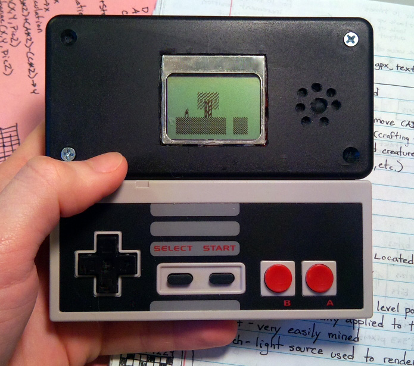

# Tiny Miasmata for the Demomite console

A game written in AVR assembly for an original handheld game console which was designed with an ATTiny2313 microcontroller (2KB flash, 128B RAM), NES controller, Nokia 3310 LCD screen, and PWM audio output.

Video Documentation
-------------------

* [Tiny Miasmata Demo Gameplay](https://www.youtube.com/watch?v=P5NU-yRJTLU)
* [Making-of Timelapse](https://www.youtube.com/watch?v=cQv1nFnKGu0)
* [Project Presentation](https://www.youtube.com/watch?v=VuSIB_ByOiU)

Mapper
------

You need Ruby with Gosu and Texplay to run the mapper, which turns an image file of a map into a code file that can be assembled into the game. Look at the map included for the colors required to make different tiles.

